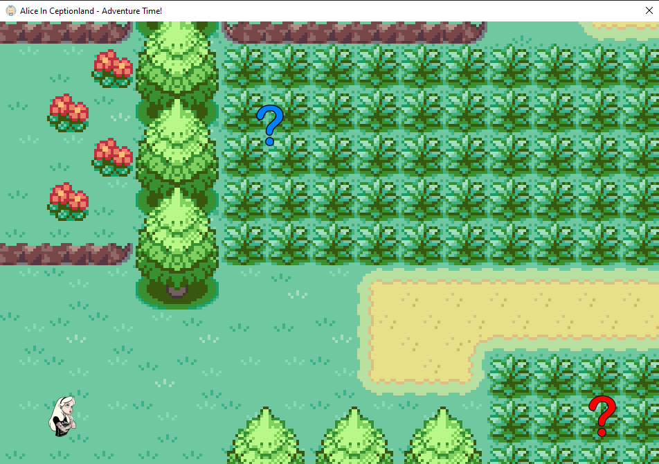
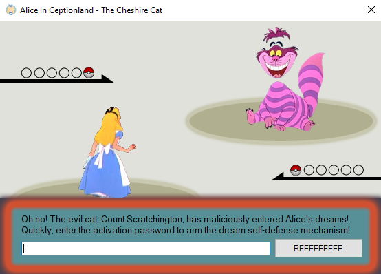
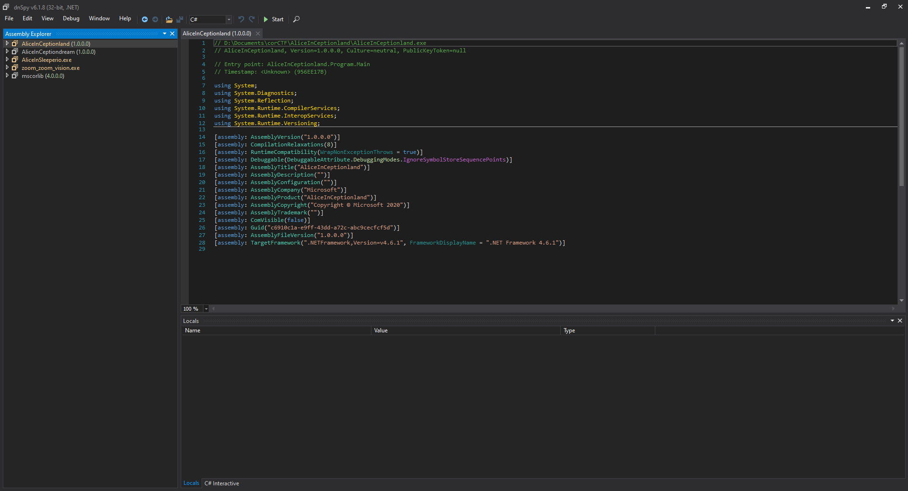
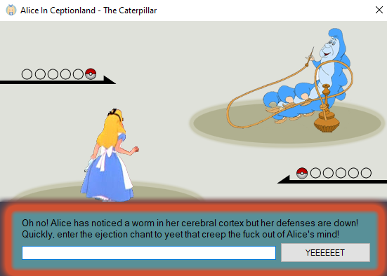
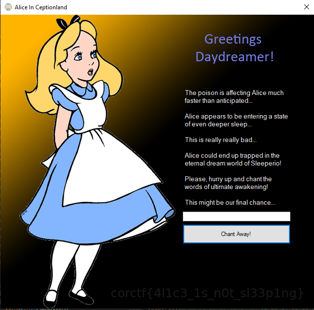
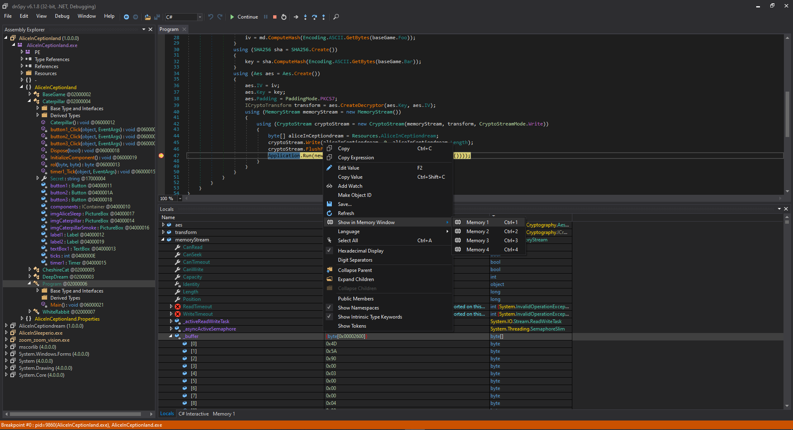
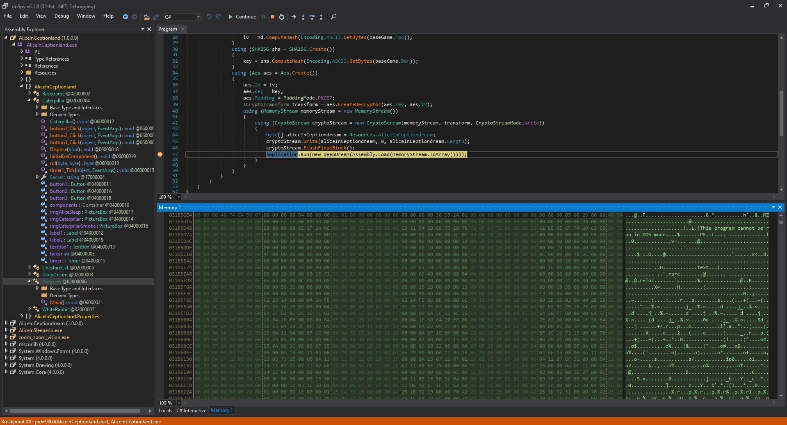
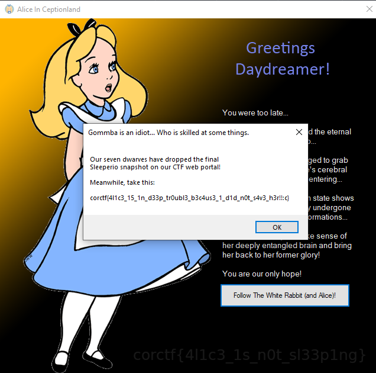

# rev/AliceInCeptionland

Writeup by gristCollector for irNoobs

> Our dear beloved Alice is undergoing a cerebral attack by some of the fiercest enemies known to man. Quick, get in there and help her!

This challenge is the first of the Alice set of reverse engineering challenges in [corCTF 2021](https://2021.cor.team/). With 56 solves, this is one of the easier challenges from that CTF.

## First Steps

### File analysis

As always with every CTF, we should first check the files given to us. In this case, it's only a single EXE file called `AliceInCeptionland.exe`. Running the `file` command on it (in Linux) with the syntax `file AliceInCeptionland.exe`, we get the following output.

```bash
AliceInCeptionland.exe: PE32 executable (GUI) Intel 80386 Mono/.Net assembly, for MS Windows
```

Already this is telling us a lot of things about the binary:

1. It's a 32-bit executable file (meaning that we have to use 32-bit debuggers)

2. It's a Mono/.NET Assembly (meaning that the program is written in C#)

3. It's a Windows .EXE file (meaning it has to be opened under a Windows system)

Mono or .NET assemblies are very interesting in reverse-engineering as more often than not, they decompile easily to their original C# code (or at least close enough to it). We can take a good look at these with a .NET assembly browser like [ILSpy](https://github.com/icsharpcode/ILSpy) or [dnSpy](https://github.com/dnSpy/dnSpy). In this writeup, I will be using dnSpy. (There is no reason to this, I just think it's neat.)

### Opening the file

> Warning: This file may trigger Windows Defender due to some mechanisms inside the program that will be explained later. Rest assured that this ***isn't*** malware designed to mine the hip and new cryptocurrency corCoin. If you cannot open this file due to Windows saying that it's a virus, add the program to Windows Defender's exceptions or disable Windows Defender temporarily.

Now that we know what type of file it is, let's first try running the program. As was mentioned earlier, the program must be run in Windows. We will then be greeted by the following game (and a really loud piece of music, so you might want to lower your volume).



Pressing the arrow keys, we can move Alice around the map. Alice does not seem to be able to get onto the bottom-right question mark, but we can touch the upper question mark. Upon touching this question mark, the game window disappears and gets replaced by the following window.



This window appears to be some sort of password check. Typing random characters into the textbox and then clicking the button does nothing. Maybe if we figure out the right password, it would do something? Without a valid password, we can't really do much from here. The next move shall now be investigating the binary inside dnSpy.

## dnSpy Investigation

To open the file in dnSpy, dragging and dropping the file into dnSpy works.

We will then be greeted by the following text.



From what dnSpy says in the comment

```cs
// Entry point: AliceInCeptionland.Program.Main
```

We now know that program starts that that specific function. By clicking on the arrows inside the Assembly Explorer (sidebar), we can head to `AliceInCeptionland.Program`. From here, we can read the code being run by the program. The following is what dnSpy generates as the code inside `AliceInCeptionland.Program`

```cs
using System;
using System.IO;
using System.Reflection;
using System.Security.Cryptography;
using System.Text;
using System.Windows.Forms;
using AliceInCeptionland.Properties;

namespace AliceInCeptionland
{
    internal static class Program
    {
        [STAThread]
        private static void Main()
        {
            Application.EnableVisualStyles();
            Application.SetCompatibleTextRenderingDefault(false);
            BaseGame baseGame = new BaseGame();
            Application.Run(baseGame);
            if (!string.IsNullOrEmpty(baseGame.Foo) && !string.IsNullOrEmpty(baseGame.Bar))
            {
                byte[] iv = null;
                byte[] key = null;
                using (MD5 md = MD5.Create())
                {
                    iv = md.ComputeHash(Encoding.ASCII.GetBytes(baseGame.Foo));
                }
                using (SHA256 sha = SHA256.Create())
                {
                    key = sha.ComputeHash(Encoding.ASCII.GetBytes(baseGame.Bar));
                }
                using (Aes aes = Aes.Create())
                {
                    aes.IV = iv;
                    aes.Key = key;
                    aes.Padding = PaddingMode.PKCS7;
                    ICryptoTransform transform = aes.CreateDecryptor(aes.Key, aes.IV);
                    using (MemoryStream memoryStream = new MemoryStream())
                    {
                        using (CryptoStream cryptoStream = new CryptoStream(memoryStream, transform, CryptoStreamMode.Write))
                        {
                            byte[] aliceInCeptiondream = Resources.AliceInCeptiondream;
                            cryptoStream.Write(aliceInCeptiondream, 0, aliceInCeptiondream.Length);
                            cryptoStream.FlushFinalBlock();
                            Application.Run(new DeepDream(Assembly.Load(memoryStream.ToArray())));
                        }
                    }
                }
            }
        }
    }
}
```

A quick glance at this and we can see that the application runs the `baseGame` object first, and then performs some sort of AES decryption to create an assembly and pass it to a new `DeepDream` object when `baseGame` is done running. Something that should be noted here is that the AES decryption is done using the `Foo` and `Bar` variables inside the `BaseGame` object.

Let's now investigate the `BaseGame` object and see how it works. Hopefully, this is where the password checks we saw in the beginning are being done.

## Inside the BaseGame

Opening the BaseGame class in dnSpy, we are greeted to a lot of code. A lot of the code is simply for initializing the game window or performing the tasks required to show graphics on the screen and is therefore mostly irrelevant to the challenge. We can simply ignore these, except for the following lines in the `BaseGame_KeyDown` function:

```cs
if (location == this.imgFirst.Location && this.imgFirst.Visible)
{
    base.Visible = false;
    CheshireCat cheshireCat = new CheshireCat();
    if (cheshireCat.ShowDialog(this) != DialogResult.OK)
    {
        base.Close();
        return;
    }
    this.Foo = cheshireCat.Secret;
    this.imgFirst.Visible = false;
    base.Visible = true;
}
else if (location == this.imgSecond.Location)
{
    if (this.imgFirst.Visible)
    {
        location = this.imgActor.Location;
    }
    else
    {
        base.Visible = false;
        Caterpillar caterpillar = new Caterpillar();
        if (caterpillar.ShowDialog(this) != DialogResult.OK)
        {
            base.Close();
            return;
        }
        this.Bar = caterpillar.Secret;
        base.Visible = true;
        base.Close();
    }
}
```

The program flow of this function confirms the program's activity from earlier. We do need to complete the password check in order to proceed with the rest of the program.

Here, we can also see that the `BaseGame`'s `Foo` and `Bar` variables are being set by the `Secret` variables of `cheshireCat` and `caterpillar`. As mentioned earlier, the `Foo` and `Bar` variables are very important to the decryption of some sort of assembly. This means that we would now have to take a look at both the `CheshireCat` class and the `Caterpillar` class to see how these secrets are being set.

### The Cheshire Cat

Taking a quick look at the `CheshireCat` class, there is a function that really stands out compared to everything else: the `button1_Click` function.

```cs
private void button1_Click(object sender, EventArgs e)
{
    string text = WhiteRabbit.Transform("41!ce1337");
    char[] array = WhiteRabbit.Transform(this.textBox1.Text).Reverse<char>().ToArray<char>();
    for (int i = 0; i < array.Length; i++)
    {
        char[] array2 = array;
        int num = i;
        array2[num] ^= text[i % text.Length];
    }
    if (string.Join<char>("", array.Reverse<char>()).Equals("oI!&}IusoKs ?Ytr"))
    {
        this.Secret = this.textBox1.Text;
        this.label1.Visible = false;
        this.textBox1.Visible = false;
        this.button1.Visible = false;
        this.timer1.Start();
    }
}
```

Well, this is certainly interesting. First off, `this.textBox1` appears to be the input box from earlier. The `this.textBox1.text` variable refers to the text inside `textBox1`, which means that this is our text input in the game! Secondly, if the `if` statement passes, the `Secret` variable for the object is set and it then sets itself invisible. This appears to be the password check for the Cheshire Cat from earlier!

Now let's disect how the password check works. There is a lot of usage of the `WhiteRabbit.Transform` function in this one, so let's first take a quick peek at that.

```cs
using System;

namespace AliceInCeptionland
{
    internal class WhiteRabbit
    {
        private static string BigMistake { get; } = "Wow you actually followed the white rabbit...";

        private static string BiggerMistake { get; } = "Circle back and start following Alice!";

        public static string Transform(string s)
        {
            return s;
        }
    }
}
```

it seems that the `Transform` function simply returns the string that is passed into it. Because of this, we can simplify the code into the following.

```cs
private void button1_Click(object sender, EventArgs e)
{
    string text = "41!ce1337";
    char[] array = this.textBox1.Text.Reverse<char>().ToArray<char>();
    for (int i = 0; i < array.Length; i++)
    {
        char[] array2 = array;
        int num = i;
        array2[num] ^= text[i % text.Length];
    }
    if (string.Join<char>("", array.Reverse<char>()).Equals("oI!&}IusoKs ?Ytr"))
    {
        this.Secret = this.textBox1.Text;
        this.label1.Visible = false;
        this.textBox1.Visible = false;
        this.button1.Visible = false;
        this.timer1.Start();
    }
}
```

So we have a string `text` set to `"41!ce1337"`, and a character array `array` that is set to the reverse of the input. The string and the array are then passed inside a loop where:

1. A character array `array2` is set to `array`.

2. An integer `num` is set to `i`.

3. The value in `array2[num]` is set to the bitwise XOR value of itself and `text[i % text.Length]`.

We need not worry about the first two points as these are simply obfuscation tactics. In C#, character arrays are treated the same way as they are in C: as pointers. Therefore, `array2` is a pointer to `array` and any modifications done to `array2` are reflected in `array`. As for the integer `num`, it's simply a copy of `i`. Further simplifying the code above, we get this:

```cs
private void button1_Click(object sender, EventArgs e)
{
    string text = "41!ce1337";
    char[] array = this.textBox1.Text.Reverse<char>().ToArray<char>();
    for (int i = 0; i < array.Length; i++)
    {
        array[i] ^= text[i % text.Length];
    }
    if (string.Join<char>("", array.Reverse<char>()).Equals("oI!&}IusoKs ?Ytr"))
    {
        ...
    }
}
```

We can now clearly see that this is just [XOR encryption](https://en.wikipedia.org/wiki/XOR_cipher) with the key being the text `"41!ce1337"` being applied over and over again. The array is then reversed and checked if equal with the string `"oI!&}IusoKs ?Ytr"`.

The solution for this portion of the game will be about reversing the algorithm about. Firstly, since the output is reversed, we need to re-reverse it to put it in to the state right after the XOR loop. Next, we will have to deal with the XOR. Thankfully, XOR is reversible if we have the key, and in this case we do! So we can simply re-apply the key `"41!ce1337"` to the output and we shall have our reversed input. From there, we can just reverse it to get our actual input into the program.

In Python code, this is what we have to do:

```py
key = "41!ce1337" # key obtained from code
output = "oI!&}IusoKs ?Ytr"[::-1] # reverse the output string
inp = "" # input string

for i, char in enumerate(output):
    inp += chr(ord(char) ^ ord(key[i % len(key)])) # perform xor

print(inp[::-1]) # reverse the input string and print it to console
```

Running this code will give us the password to the Cheshire Cat prompt, which is `\xDE\xAD\xBE\xEF`.

### The Caterpillar

After submitting the password to the Cheshire Cat prompt, we will be thrown back into the game world. This time, however, the bottom-right question mark is now accessible! As with the Cheshire Cat, however, it's another password prompt.



Well, good thing we already know where this prompt is being launched from: `AliceInCeptionland.Caterpillar`. It basically has the same drawing processes as the `CheshireCat` class, so it is very fair to assume that the password check is happening again in `Caterpillar.button1_Click`.

```cs
private void button1_Click(object sender, EventArgs e)
{
    string text = WhiteRabbit.Transform("c4t3rp1114rz_s3cr3t1y_ru13_7h3_w0r1d");
    char[] array = WhiteRabbit.Transform(this.textBox1.Text).Reverse<char>().ToArray<char>();
    for (int i = 0; i < array.Length; i++)
    {
        byte b = Convert.ToByte(array[i]);
        b = this.rol(b, 114);
        b += 222;
        b ^= Convert.ToByte(text[i % text.Length]);
        b -= 127;
        b = this.rol(b, 6);
        array[i] = Convert.ToChar(b);
    }
    if (string.Join<char>("", array.Reverse<char>()).Equals("\0R\u009c\u007f\u0016ndC\u0005î\u0093MíÃ×\u007f\u0093\u0090\u007fS}­\u0093)ÿÃ\f0\u0093g/\u0003\u0093+ö\0Rt\u007f\u0016\u0087dC\aî\u0093píÃ8\u007f\u0093\u0093\u007fSz­\u0093ÇÿÃÓ0\u0093\u0086/\u0003q"))
    {
        this.Secret = this.textBox1.Text;
        this.label1.Visible = false;
        this.textBox1.Visible = false;
        this.button1.Visible = false;
        this.timer1.Start();
    }
}
```

Well, this looks significantly harder than the `CheshireCat` password prompt but the main idea should still be the same. There is still an `if` statement that checks whether or not we have the correct password, and therefore we can work backwards from there. `WhiteRabbit.Transform` also makes an appearance here as well, but there's a new function here that we need to take a look at: the `rol()` function

```cs
private byte rol(byte v, byte s)
{
    byte b = s % 8;
    return (byte)((int)v << (int)b | v >> (int)(8 - b));
}
```

This function is a C# implementation of [bit rotates of integers](https://www.geeksforgeeks.org/rotate-bits-of-an-integer/). To put it succintly, it simply moves the last `b` bits and makes them the first `b` bits and the original `8-b` first bits are moved to become the last `8-b` bits.

Using the same concepts from before, we can simplify the code to the following:

```cs
string text = "c4t3rp1114rz_s3cr3t1y_ru13_7h3_w0r1d";
char[] array = this.textBox1.Text.Reverse<char>().ToArray<char>();
for (int i = 0; i < array.Length; i++)
{
    byte b = Convert.ToByte(array[i]);
    b = this.rol(b, 114) + 222; // the rol simplifies to this.rol(b, 2)
    b ^= Convert.ToByte(text[i % text.Length]);
    b = this.rol(b - 127, 6);
    array[i] = Convert.ToChar(b);
}
if (string.Join<char>("", array.Reverse<char>()).Equals("\0R\u009c\u007f\u0016ndC\u0005î\u0093MíÃ×\u007f\u0093\u0090\u007fS}­\u0093)ÿÃ\f0\u0093g/\u0003\u0093+ö\0Rt\u007f\u0016\u0087dC\aî\u0093píÃ8\u007f\u0093\u0093\u007fSz­\u0093ÇÿÃÓ0\u0093\u0086/\u0003q"))
```

The challenge we now have is reversing the `rol` function, but thankfully it's also really simple as passing it right back into the same function, but using `8 - (n % 8)` as the number of bits to rotate it by.

Same as before, our key for the XOR encryption is the `text` variable, and it's applied over and over again until the end of the input string with some preprocessing and postprocessing (the addition and subtraction of some constants).

The following implements the decryption of the string in the `Equals` portion in Python:

```py
def rol(byte, n): # assumes that n is already modulo'd by 8
    return ((byte << n) & 0xff) | (byte >> (8-n))

def solve_caterpillar():
    key = "c4t3rp1114rz_s3cr3t1y_ru13_7h3_w0r1d"
    output = "\0R\u009c\u007f\u0016ndC\u0005î\u0093MíÃ×\u007f\u0093\u0090\u007fS}­\u0093)ÿÃ\f0\u0093g/\u0003\u0093+ö\0Rt\u007f\u0016\u0087dC\aî\u0093píÃ8\u007f\u0093\u0093\u007fSz­\u0093ÇÿÃÓ0\u0093\u0086/\u0003q"[::-1] # reverse output string
    inp = ""

    for i, char in enumerate(output):
        b = (rol(ord(char), 2) + 127) % 256 # reverse of b = this.rol(b - 127, 6);
        b ^= ord(key[i % len(key)]) # reverse of b ^= Convert.ToByte(text[i % text.Length]);
        b = rol((b - 222) % 256, 6) # reverse of this.rol(b, 114) + 222;
        inp += chr(b)

    print(inp[::-1])
```

As to why there is a lot of `% 256` in the code, it's to maintain the "byteness" of the numbers being passed. All numbers can only be between 0 to 255 because the data types being used in the original function is a byte.

Running this, we will get the solution `\x4\xL\x1\xC\x3\x1\xS\xN\x0\xT\x4\xS\xL\x3\x3\xP\xS\x4\xV\x3\xH\x3\xR` for the second password check.

## DeepDream

After passing the password check, we get two buttons asking us to either follow Alice and save her, or a button that asks for the flag. Naturally, the second option is just a pop-up telling us to go save her, so there's really only one option from here. Clicking that button gives the following prompt.



Remember that from earlier, this is now out of the `BaseGame`'s scope and this is now involving the encrypted binary and the `DeepDream` class. This is a reason for Windows Defender marking the EXE as a virus. The EXE decrypts an assembly that it later  Some malware use this method in order to mask themselves from antivirus scanners.

To save us the headache later, let's grab the assembly from memory.

```cs
// Program.Main()
private static void Main()
{
    Application.EnableVisualStyles();
    Application.SetCompatibleTextRenderingDefault(false);
    BaseGame baseGame = new BaseGame(); // BaseGame now solved
    Application.Run(baseGame);
    // Proceed with the decryption
    if (!string.IsNullOrEmpty(baseGame.Foo) && !string.IsNullOrEmpty(baseGame.Bar))
    {
        byte[] iv = null;
        byte[] key = null;
        using (MD5 md = MD5.Create())
        {
            iv = md.ComputeHash(Encoding.ASCII.GetBytes(baseGame.Foo));
        }
        using (SHA256 sha = SHA256.Create())
        {
            key = sha.ComputeHash(Encoding.ASCII.GetBytes(baseGame.Bar));
        }
        using (Aes aes = Aes.Create())
        {
            aes.IV = iv;
            aes.Key = key;
            aes.Padding = PaddingMode.PKCS7;
            ICryptoTransform transform = aes.CreateDecryptor(aes.Key, aes.IV);
            using (MemoryStream memoryStream = new MemoryStream())
            {
                using (CryptoStream cryptoStream = new CryptoStream(memoryStream, transform, CryptoStreamMode.Write))
                {
                    byte[] aliceInCeptiondream = Resources.AliceInCeptiondream;
                    cryptoStream.Write(aliceInCeptiondream, 0, aliceInCeptiondream.Length);
                    cryptoStream.FlushFinalBlock();
                    // Place a breakpoint on the following line, debug the program,
                    // and dump the assembly from memory.
                    Application.Run(new DeepDream(Assembly.Load(memoryStream.ToArray())));
                }
            }
        }
    }
}
```

 If we attach a breakpoint during execution just after the decryption in the main program, we can pull the assembly directly from memory and dump it into a file and analyze it inside dnSpy. dnSpy lets us debug .NET assemblies and lets us place breakpoints where in the code we want to debug.



The assembly can be found in `memoryStream._buffer` and its value can be peeked at in dnSpy while debugging. From there we can grab its hex values, decode it and save it as a DLL file.



Now that we have the assembly dumped, we can take a look at where it's passed to. We need to know how the assembly is being processed right after loading, and how it's being used.

```cs
public DeepDream(Assembly dream)
{
    this.InitializeComponent();
    this.Dream = dream;
}

private void button1_Click(object sender, EventArgs e)
{
    if (!((string)this.Dream.GetType("AliceInCeptiondream.Dream").GetMethod("Encode").Invoke(null, new object[]
    {
        this.textBox1.Text
    })).Equals("3c3cf1df89fe832aefcc22fc82017cd57bef01df54235e21414122d78a9d88cfef3cf10c829ee32ae4ef01dfa1951cd51b7b22fc82433ef7ef418cdf8a9d802101ef64f9a495268fef18d52882324f217b1bd64b82017cd57bef01df255288f7593922712c958029e7efccdf081f8808a6efd5287595f821482822f6cb95f821cceff4695495268fefe72ad7821a67ae0060ad"))
    {
        MessageBox.Show(this, "If you were to chant these words of stupidity,\nI'd imagine we would never see Alice again...\nTry another chant... Something has to work!", "Probably you are 1000 kilogram in basement.");
        return;
    }
    this.label1.Visible = false;
    this.button1.Visible = false;
    this.textBox1.Visible = false;
    this.label2.Visible = true;
    this.button2.Visible = true;
}
```

Here we go again.

This portion of DeepDream is calling the `Dream` class from the loaded assembly and calls the `Encode` function, passing on the text from the input as the argument. This is then checked with some really long string and if the `if` statement is true, it proceeds to the next part of its programming.

As we have just obtained what was the encrypted assembly, we can now open it up in dnSpy as well and see exactly how it works.

```cs
// Dream.Encode
public static string Encode(string plaintext)
{
    string text = string.Empty;
    if (!string.IsNullOrEmpty(plaintext))
    {
        string text2 = string.Join("/", plaintext.Select(new Func<char, string>(Dream.<Encode>g__fm|3_3)).ToArray<string>());
        byte[] array = new byte[]
        {
            (byte)(Dream.xm & 255UL),
            (byte)(Dream.xm >> 8 & 255UL),
            (byte)(Dream.xm >> 16 & 255UL),
            (byte)(Dream.xm >> 24 & 255UL),
            (byte)(Dream.xm >> 32 & 255UL),
            (byte)(Dream.xm >> 40 & 255UL),
            (byte)(Dream.xm >> 48 & 255UL),
            (byte)(Dream.xm >> 56 & 255UL)
        };
        for (int i = 0; i < text2.Length; i++)
        {
            text += string.Format("{0:x2}", (byte)text2[i] ^ array[i % array.Length]);
        }
    }
    bool flag = false;
    if (Dream.CheckRemoteDebuggerPresent(Process.GetCurrentProcess().Handle, ref flag) && flag)
    {
        text = string.Join<char>("", text.Reverse<char>().ToArray<char>());
    }
    return text;
}

internal static string <Encode>g__fm|3_3(char c)
{
    return string.Join("", new string[]
    {
        Dream.<Encode>g__fx|3_2(c, new string(Dream.rm[(int)Dream.<Encode>g__fl|3_0(c)].Select(new Func<char, char>(Dream.<Encode>g__fr|3_1)).ToArray<char>()))
    });
}

// other functions truncated from this writeup, view the dll in dnSpy for full decompile
```

As can be seen in this snippet, there's a lot to unpack but some we can just ignore. For one, the `CheckRemoteDebuggerPresent` is simply an anti-debugging measure to throw off anyone who thinks of skipping past this portion. If we are running this without any debuggers attached, `flag` should stay false and never reverse the output.

The problem now lies in breaking down the encoding and finding out if there's anything we can break. Simply reversing the process like we did earlier will be a lot more tedious this time around as there are a lot of functions being thrown about. It's still doable, but very ill-advised given the time constraints of the CTF. Instead, what must be done is a somewhat optimized brute-force of the encoding.

The method of breaking the encoding becomes very obvious if we try to encode two very similar strings. We can create a C# program to calculate what their encodings would be since dnSpy has the source code for the `Dream` class. The following should display to the console what the encodings of the strings `a`, `aa`, `ab`, and `aaa` would be.

```cs
// It is implied that the Dream class is already imported in this piece of code.
public class Program
{
    public static void Main(string[] args)
    {
        Console.WriteLine("a  : " + Dream.Encode("a"));
        Console.WriteLine("aa : " + Dream.Encode("aa"));
        Console.WriteLine("ab : " + Dream.Encode("ab"));
        Console.WriteLine("aaa: " + Dream.Encode("aaa"));
    }
}
```

And its output would be the following:

```
a  : 4828
aa : 4828227845
ab : 4828227b46514c
aaa: 4828227845952fe6
```

As can be seen here, the encodings of `aa` and `ab` start with the encoding of `a`, and `aaa` starts with the encodings of `aa` and `a`. This is where the weakness of the encoding algorithm shows itself. Essentially, this means that the encodings of two strings that start with the same combination of letters will end up starting with the same combination of hexadecimal characters.

So now the plan for bruteforcing the correct string: Instead of having to bruteforce for every combination of letters and symbols to figure out the correct string, we can instead attempt to bruteforce it character by character by testing if fully encoded string starts with our guess encoding's string. The following C# code implements this idea.

```cs
public class Program
{
    public static void Main(string[] args)
    {
        string finalEncoding = "3c3cf1df89fe832aefcc22fc82017cd57bef01df54235e21414122d78a9d88cfef3cf10c829ee32ae4ef01dfa1951cd51b7b22fc82433ef7ef418cdf8a9d802101ef64f9a495268fef18d52882324f217b1bd64b82017cd57bef01df255288f7593922712c958029e7efccdf081f8808a6efd5287595f821482822f6cb95f821cceff4695495268fefe72ad7821a67ae0060ad";
        string guess = ""; // our initial guess is nothing
        do
        {
            for (int i = 0x20; i < 0x7f; i++) // only bruteforce printable ascii characters
            {
                string encoded = Dream.Encode((guess + (char)i)); // encoded string for guess
                if (finalEncoding.StartsWith(encoded)) // if it's a match, we have the right character
                {
                    guess += (char)i; // add the character to the successes to build string
                    break; // break from loop for optimization
                }
            }
            Console.WriteLine("Guess: " + guess); // print guess
        } while (!Dream.Encode(guess).Equals(finalEncoding)); // keep going until the entire string is found
        Console.WriteLine("Final: " + guess); // print the solution
    }
}
```

Output:

```
Guess: S
Guess: Sl
Guess: Sle
Guess: Slee
Guess: Sleep
Guess: Sleepe
Guess: Sleeper
Guess: Sleeperi
Guess: Sleeperio
Guess: Sleeperio 
Guess: Sleeperio S
Guess: Sleeperio Sl
Guess: Sleeperio Sle
Guess: Sleeperio Slee
Guess: Sleeperio Sleep
Guess: Sleeperio Sleepe
Guess: Sleeperio Sleeper
Guess: Sleeperio Sleeperi
Guess: Sleeperio Sleeperio
Guess: Sleeperio Sleeperio 
Guess: Sleeperio Sleeperio D
Guess: Sleeperio Sleeperio Di
Guess: Sleeperio Sleeperio Dis
Guess: Sleeperio Sleeperio Disa
Guess: Sleeperio Sleeperio Disap
Guess: Sleeperio Sleeperio Disapp
Guess: Sleeperio Sleeperio Disappe
Guess: Sleeperio Sleeperio Disappea
Guess: Sleeperio Sleeperio Disappear
Guess: Sleeperio Sleeperio Disappeari
Guess: Sleeperio Sleeperio Disappeario
Guess: Sleeperio Sleeperio Disappeario 
Guess: Sleeperio Sleeperio Disappeario I
Guess: Sleeperio Sleeperio Disappeario In
Guess: Sleeperio Sleeperio Disappeario Ins
Guess: Sleeperio Sleeperio Disappeario Inst
Guess: Sleeperio Sleeperio Disappeario Insta
Guess: Sleeperio Sleeperio Disappeario Instan
Guess: Sleeperio Sleeperio Disappeario Instant
Guess: Sleeperio Sleeperio Disappeario Instante
Guess: Sleeperio Sleeperio Disappeario Instanter
Guess: Sleeperio Sleeperio Disappeario Instanteri
Guess: Sleeperio Sleeperio Disappeario Instanterio
Guess: Sleeperio Sleeperio Disappeario Instanterio!
Final: Sleeperio Sleeperio Disappeario Instanterio!
```

And just like that we get the solution to the final password check!

## The Flag



And finally, the flag: `corctf{4l1c3_15_1n_d33p_tr0ubl3_b3c4us3_1_d1d_n0t_s4v3_h3r!!:(}`
